# 🔍 ForecastAI v1.2.1 — Full Project Audit Report

Ngày kiểm tra: 29/06/2026

---

## Sơ đồ tổng quan liên kết

```mermaid
graph TB
    subgraph Frontend["Frontend (Next.js 15)"]
        FP["/ Dashboard"]
        FM["/markets"]
        FR["/research"]
        FRD["/research/:ticker"]
        FF["/forecast"]
        FFD["/forecast/:symbol"]
        FPO["/portfolio"]
        FAT["/auto-trade"]
        FA["/admin"]
        FS["/settings"]
        FL["/login"]
        FRG["/register"]
    end

    subgraph API["api.ts (tryFetch calls)"]
        A1["/market/overview"]
        A2["/market/live/:ticker"]
        A3["/forecast/combined/:ticker"]
        A4["/admin/leaderboard"]
        A5["/research/reports"]
        A6["/research/:ticker"]
        A7X["/api/research/:id/translate ❌"]
        A8["/admin/portfolio"]
        A9["/admin/trading/start"]
        A10["/admin/trading/stop"]
        A11["/admin/trading/config"]
        A12["/admin/users"]
        A13["/admin/users/:id/balance"]
        A14["/admin/users/:id/status"]
        A15["/admin/users/:id/role"]
        A16["/admin/users/:id DELETE"]
        A17["/admin/system/accuracy"]
        A18X["/api/admin/system ❌"]
        A19X["/api/admin/research-queue ❌"]
        A20["/admin/watchlist"]
        A21["/auth/login"]
        A22["/auth/register"]
        A23["/notifications"]
    end

    subgraph Backend["Backend (FastAPI)"]
        B1["market.overview"]
        B2["market.live"]
        B3["forecast.combined"]
        B4["admin.leaderboard"]
        B5["research.reports"]
        B6["research.ticker"]
        B8["admin.portfolio"]
        B9["admin.trading_start"]
        B10["admin.trading_stop"]
        B11["admin.trading_config"]
        B12["admin.users"]
        B13["admin.balance"]
        B14["admin.status"]
        B15["admin.role"]
        B16["admin.delete"]
        B17["admin.accuracy"]
        B20["admin.watchlist"]
        B21["auth.login"]
        B22["auth.register"]
        B23["notifications.*"]
    end

    FP --> A1 & A4 & A8
    FM --> A1 & A20
    FR --> A5
    FRD --> A6 & A7X
    FF --> A3
    FFD --> A3
    FPO --> A8
    FAT --> A8 & A9 & A10 & A11
    FA --> A12 & A13 & A14 & A15 & A16 & A17 & A18X & A19X
    FL --> A21
    FRG --> A22

    A1 --> B1
    A2 --> B2
    A3 --> B3
    A4 --> B4
    A5 --> B5
    A6 --> B6
    A8 --> B8
    A9 --> B9
    A10 --> B10
    A11 --> B11
    A12 --> B12
    A13 --> B13
    A14 --> B14
    A15 --> B15
    A16 --> B16
    A17 --> B17
    A20 --> B20
    A21 --> B21
    A22 --> B22
    A23 --> B23

    style A7X fill:#f66,color:#fff
    style A18X fill:#f66,color:#fff
    style A19X fill:#f66,color:#fff
```

---

## 🔴 LỖI NGHIÊM TRỌNG (CRITICAL) — Cần fix ngay

### 1. `translateReport()` gọi endpoint không tồn tại
- **File frontend**: [api.ts:180-181](file:///c:/Users/ann28/Documents/Nam3-Ky1/DoAn/ForecastAI/frontend/src/lib/api.ts#L180-L181)
- **Đường dẫn gọi**: `tryFetch("/api/research/${id}/translate")`
- **Vấn đề**: Prefix `/api/` không tồn tại trong backend. Backend chỉ có prefix `/research/`. Thêm nữa, **không có endpoint `translate` nào** được định nghĩa trong `backend/routers/research.py`.
- **Hiện tại**: Lỗi bị ẩn vì `tryFetch` bắt lỗi và trả fallback mock data.
- **Cách fix**: Tạo endpoint `/research/{id}/translate` trong backend hoặc xóa bỏ tính năng dịch nếu không cần.

### 2. `getSystemMetrics()` gọi endpoint không tồn tại
- **File frontend**: [api.ts:331](file:///c:/Users/ann28/Documents/Nam3-Ky1/DoAn/ForecastAI/frontend/src/lib/api.ts#L331)
- **Đường dẫn gọi**: `tryFetch("/api/admin/system")`
- **Vấn đề**: Prefix `/api/admin/system` không tồn tại. Backend không có router nào lắng nghe đường dẫn này.
- **Hiện tại**: Fallback sang data ảo `SYSTEM_METRICS`.
- **Cách fix**: Tạo endpoint hoặc xóa prefix `/api/` (thay bằng `/admin/system`).

### 3. `getResearchQueue()` gọi endpoint không tồn tại
- **File frontend**: [api.ts:338](file:///c:/Users/ann28/Documents/Nam3-Ky1/DoAn/ForecastAI/frontend/src/lib/api.ts#L338)
- **Đường dẫn gọi**: `tryFetch("/api/admin/research-queue")`
- **Vấn đề**: Tương tự, prefix `/api/` sai. Và backend không có endpoint `research-queue`.
- **Hiện tại**: Fallback sang data ảo `RESEARCH_QUEUE`.
- **Cách fix**: Tạo endpoint hoặc xóa prefix `/api/`.

---

## 🟡 CẢNH BÁO (WARNING) — Nên sửa

### 4. Settings page: "Save" và "Change password" chưa hoạt động
- **File**: [settings/page.tsx](file:///c:/Users/ann28/Documents/Nam3-Ky1/DoAn/ForecastAI/frontend/src/app/settings/page.tsx)
- **Vấn đề**:
  - Nút **"Save"** (dòng 92) chỉ gọi `setSaved(true)` — không gửi request nào lên backend.
  - Nút **"Change password"** (dòng 70) không có `onClick` — hoàn toàn không làm gì.
  - Các toggle **Notification preferences** chỉ lưu trong React state cục bộ, không persist.
- **Ảnh hưởng**: Người dùng bấm Save tưởng đã lưu nhưng thực tế mất hết khi reload trang.

### 5. Google OAuth: chỉ hiện alert placeholder
- **File**: [login/page.tsx:89](file:///c:/Users/ann28/Documents/Nam3-Ky1/DoAn/ForecastAI/frontend/src/app/login/page.tsx#L89)
- **Vấn đề**: Nút "Continue with Google" chỉ `alert("Tính năng đang được phát triển...")`. Trong khi `README_INTERNAL.md` ghi là "Google OAuth: Đăng nhập trực tiếp qua nút Google" — tạo sự mâu thuẫn giữa tài liệu và code thực tế.

### 6. Auth store `login()` không lưu user_id thật từ backend
- **File**: [store.ts:49-57](file:///c:/Users/ann28/Documents/Nam3-Ky1/DoAn/ForecastAI/frontend/src/lib/store.ts#L49-L57)
- **Vấn đề**: Hàm `login()` luôn hardcode `id: "u_1"` thay vì nhận ID thật từ response backend. Điều này có nghĩa mọi user chia sẻ cùng 1 ID ở phía frontend state.
- **Ảnh hưởng**: Backend vẫn phân biệt user đúng qua JWT token, nhưng bất kỳ logic nào dựa vào `user.id` ở frontend sẽ sai.

### 7. `addWatchlist()` — body vs query param mismatch
- **File frontend**: [api.ts:351](file:///c:/Users/ann28/Documents/Nam3-Ky1/DoAn/ForecastAI/frontend/src/lib/api.ts#L351)
- **File backend**: [admin.py:339](file:///c:/Users/ann28/Documents/Nam3-Ky1/DoAn/ForecastAI/backend/routers/admin.py#L339)
- **Vấn đề**: Frontend gọi `POST /admin/watchlist?ticker=XYZ` (query param), nhưng backend có thể expect body hoặc khác cấu trúc. Cần verify chính xác.

### 8. `Forgot Password` button không hoạt động
- **File**: [login/page.tsx:134](file:///c:/Users/ann28/Documents/Nam3-Ky1/DoAn/ForecastAI/frontend/src/app/login/page.tsx#L134)
- **Vấn đề**: Nút `Forgot password?` không có logic nào, chỉ là `<button type="button">`.

---

## 🔵 GHI CHÚ (INFO) — Biết để tối ưu

### 9. Nhiều trang dùng data ảo (mock) khi backend không phản hồi
Các hàm sau **âm thầm** fallback sang dữ liệu ảo:

| Hàm API | Endpoint thật | Fallback |
|---------|--------------|----------|
| `getResearch()` | `/research/reports` | `RESEARCH` (mock) |
| `getAdminUsers()` | `/admin/users` | `ADMIN_USERS` (mock) |
| `getModelAccuracy()` | `/admin/system/accuracy` | `MODEL_ACCURACY` (mock) |
| `getSystemMetrics()` | ❌ `/api/admin/system` | `SYSTEM_METRICS` (mock) |
| `getResearchQueue()` | ❌ `/api/admin/research-queue` | `RESEARCH_QUEUE` (mock) |
| `getPortfolio()` | `/admin/portfolio` | `buildPortfolio()` (mock) |
| `getTransactions()` | `/admin/portfolio` | `TRANSACTIONS` (mock) |

> [!NOTE]
> Thiết kế fallback này là cần thiết để frontend không crash khi backend tắt. Tuy nhiên, người dùng không có cách nào phân biệt data thật và data giả — cần thêm chỉ báo trực quan (ví dụ badge "Demo Data" hoặc "Offline Mode").

### 10. Notifications router prefix mismatch
- **Backend**: Notifications router được include **không có prefix** ([main.py:66](file:///c:/Users/ann28/Documents/Nam3-Ky1/DoAn/ForecastAI/backend/main.py#L66)): `app.include_router(notifications.router, tags=["Notifications"])`
- **Vấn đề**: Endpoint `POST /admin/notifications` (dòng 82 trong [notifications.py](file:///c:/Users/ann28/Documents/Nam3-Ky1/DoAn/ForecastAI/backend/routers/notifications.py#L82)) được mount trực tiếp ở root `/admin/notifications`. Nếu ai đó thêm prefix `/notifications` vào main.py thì route này sẽ thành `/notifications/admin/notifications` — sai.
- **Trạng thái**: Hiện tại hoạt động đúng, nhưng cấu trúc dễ gây nhầm lẫn.

### 11. Backend `superadmin.py` vs `admin.py` — overlap quyền user management
- Cả hai file đều có endpoints để quản lý users:
  - `admin.py`: `PUT /admin/users/{user_id}/balance`, `.../status`, `.../role`, `DELETE /admin/users/{user_id}`
  - `superadmin.py`: `POST /superadmin/users/{user_id}/balance`, `DELETE /superadmin/users/{user_id}`
- **Vấn đề**: Frontend gọi `/admin/users/...` (router `admin.py`). File `superadmin.py` mount ở prefix `/superadmin` nên **không bao giờ được frontend gọi đến**.
- **Đề xuất**: Xóa hoặc hợp nhất `superadmin.py` vào `admin.py` để tránh nhầm lẫn.

### 12. Trang `/forecast` luôn fetch 5 ticker cố định
- **File**: [api.ts:92](file:///c:/Users/ann28/Documents/Nam3-Ky1/DoAn/ForecastAI/frontend/src/lib/api.ts#L92)
- **Vấn đề**: `getForecasts()` hardcode `["BTC-USD", "ETH-USD", "NVDA", "AAPL", "TSLA"]`. Nên lấy từ watchlist của user hoặc từ `MARKET_ASSETS`.

---

## ✅ CÁC LIÊN KẾT ĐÃ OKE

| Frontend Page | API Calls | Backend Endpoints | Trạng thái |
|---------------|-----------|-------------------|------------|
| `/` (Dashboard) | `getPortfolio`, `getLeaderboard`, `getTransactions`, `getMarkets` | `/admin/portfolio`, `/admin/leaderboard`, `/market/overview` | ✅ OK |
| `/markets` | `getMarkets`, `getWatchlist`, `addWatchlist`, `removeWatchlist` | `/market/overview`, `/admin/watchlist` | ✅ OK |
| `/research` | `getResearch` | `/research/reports` | ✅ OK |
| `/research/:ticker` | `getResearchReport` | `/research/:ticker` | ✅ OK |
| `/forecast` | `getForecasts` → `getForecast` × 5 | `/forecast/combined/:ticker` | ✅ OK |
| `/forecast/:symbol` | `getForecast` | `/forecast/combined/:ticker` | ✅ OK |
| `/portfolio` | `getPortfolio`, `getTransactions` | `/admin/portfolio` | ✅ OK |
| `/auto-trade` | `getAutoTradeStats`, `startBot`, `stopBot`, `getBotConfig` | `/admin/portfolio`, `/admin/trading/*` | ✅ OK |
| `/admin` | `getAdminUsers`, `updateUserBalance/Status/Role`, `deleteUser`, `getModelAccuracy` | `/admin/users/*`, `/admin/system/accuracy` | ✅ OK |
| `/login` | `api.login` | `/auth/login` | ✅ OK |
| `/register` | `api.register` | `/auth/register` | ✅ OK |
| Notifications | `getNotifications`, `markRead`, `create`, `delete` | `/notifications/*`, `/admin/notifications` | ✅ OK |
| Auto-Trade Bot Loop | `run_auto_trade()` in `main.py` lifespan | Database + Forecaster | ✅ OK |

---

## Tóm tắt ưu tiên sửa

| # | Mức độ | Mô tả | Effort |
|---|--------|-------|--------|
| 1 | 🔴 Critical | Fix 3 endpoint sai prefix `/api/` | 5 phút |
| 4 | 🟡 Warning | Settings page Save/Change password | 30 phút |
| 6 | 🟡 Warning | Auth store hardcode `id: "u_1"` | 10 phút |
| 5 | 🟡 Warning | Google OAuth placeholder vs docs | 5 phút (sửa docs) |
| 8 | 🟡 Warning | Forgot Password noop button | 20 phút |
| 11 | 🔵 Info | Merge superadmin.py vào admin.py | 15 phút |
| 12 | 🔵 Info | Forecast page lấy ticker từ watchlist | 10 phút |
